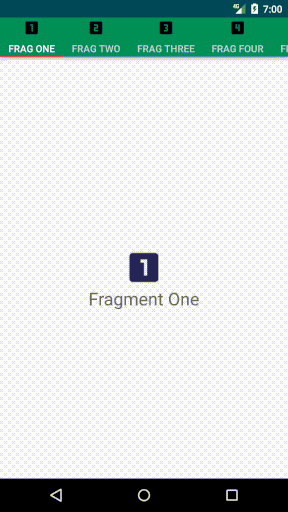

# SliderTabLayout with Icons.



Hello, 
I have focused on the implementation of **Sliding TabLayout with Icons attahed to it**, in which you will also get to know 
how **ViewPager** & **FragmentPagerAdapter** plays an important role to provide more functionality to the TabLayouts.

# What you will learn. 
- [x] Extend **FragmentPagerAdapter**.

- [x] Implementation of **design support library** in *build.gradle(Module:app)*.

- [x] Remove **ActionBar**, check *res->values->styles.xml*.

- [x] Proper use of text in **strings.xml** file in a project, check *res->values*.

# Note to Novice

In MainActivity **onCreate** method:

Remember to use **setupViewPager()** before **setupTabIcons()** otherwise you will get a *null pointer exception on runtime*.

* **setupViewPager();**
```javascript
{
        ViewPagerAdapter viewPagerAdapter = new ViewPagerAdapter(getSupportFragmentManager());
        viewPagerAdapter.addFragment(new One(),"Frag One");
        viewPagerAdapter.addFragment(new Two(),"Frag Two");
        viewPagerAdapter.addFragment(new Three(),"Frag Three");
        viewPagerAdapter.addFragment(new Four(),"Frag Four");
        viewPagerAdapter.addFragment(new Five(),"Frag Five");
        viewPagerAdapter.addFragment(new Six(),"Frag Six");

        viewPager.setAdapter(viewPagerAdapter);
        }
```
    
* **setupTabIcons();** 

```javascript
{
        tabLayout.getTabAt(0).setIcon(tabIcons[0]);
        tabLayout.getTabAt(1).setIcon(tabIcons[1]);
        tabLayout.getTabAt(2).setIcon(tabIcons[2]);
        tabLayout.getTabAt(3).setIcon(tabIcons[3]);
        tabLayout.getTabAt(4).setIcon(tabIcons[4]);
        tabLayout.getTabAt(5).setIcon(tabIcons[5]);
        }
```

# Support :+1:  
[Instagram](https://www.instagram.com/amansharma.dev/)  
[Twitter](https://twitter.com/thekod25)

### Thank You!
